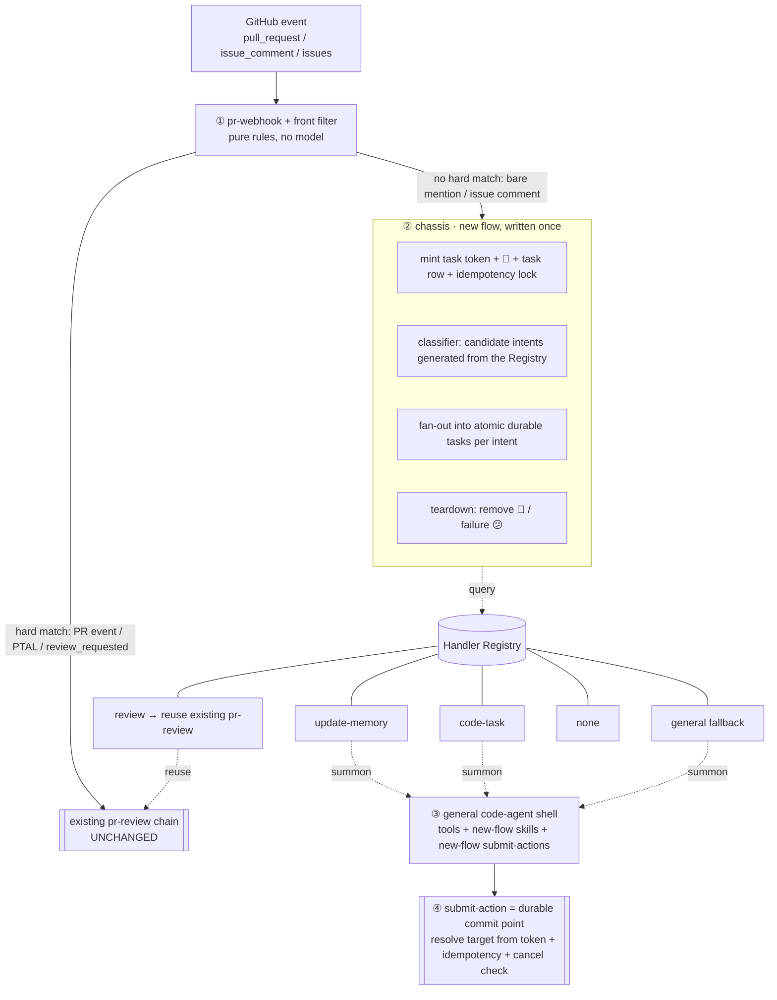
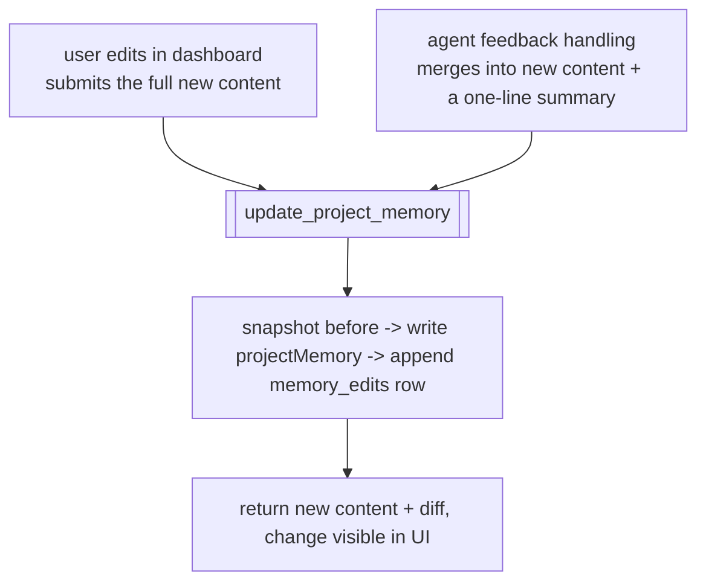
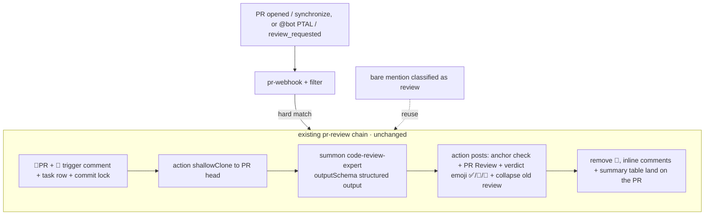
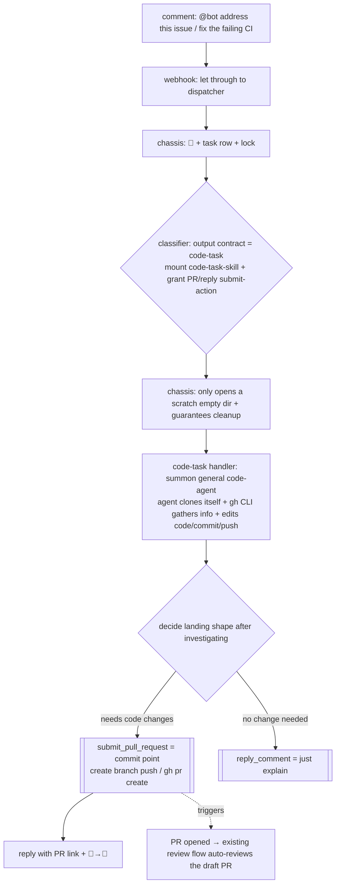

# Code Review + Agentic Code Agent — Extension Design

> ⚠️ **SUPERSEDED (v0.26.0).** The classifier-driven "new flow" described below
> (mention-dispatch chassis, intent classifier, code-agent, and the
> update-memory / code-task / general / none routes) has been **removed**. Comment
> triggers now use an **exact command** model: a PR comment must be exactly
> `@bot <phrase>` (only whitespace tolerated) — `PTAL` → `pr-review`,
> `summary` → `pr-summary`; anything else is ignored. This makes it structurally
> impossible for the bot's own comments to re-trigger it (no invocation storm).
> This document is kept for historical context only.

> Status: design agreed, implementation planning pending
> Scope: `apps/code-review`
> Goal: **leave the existing code review untouched**, add a filter in front of it, and **add a parallel** coding + general + memory-feedback flow.

## Integration Strategy (the first principle of this design)

**The existing code review works well — don't change it.** New capabilities are purely additive, routed by a single **filter** in front of `pr-webhook`:

- **Hard match** (PR opened/synchronize, review_requested, the PTAL phrase) → goes **straight into the existing `pr-review`, unchanged** (emoji / locks / clone / summon `code-review-expert` / posting all stay as-is).
- **No hard match** (bare mention, comments on issues) → enters the **new flow**'s classifier → `update-memory` / `code-task` / `general` / `none`. If it classifies as review, it **reuses the existing `pr-review`** rather than reimplementing it.

Therefore:

- The dispatcher chassis / general code-agent / submit-action / scratch dir described in sections 3–4, 7b, 8 **serve the new flow only**; the existing review does not use any of it.
- **`code-review-expert` agent is kept** (it has a review-specific outputSchema); the general code-agent serves the new flow only → **the two agents coexist**.
- **No `submit_code_review_result`** (review keeps its existing summon outputSchema + action posting). The new submit-actions are only `update_project_memory` / `submit_pull_request` / `reply_comment`.

---

## 1. Background & Goals

Today's code review is **one-way**: it can review a PR, add emoji, and post a structured review — but it **lacks a feedback loop**. There's no mechanism to capture "human feedback on reviews / project-specific knowledge", so every review reasons from scratch.

Core goals:

1. **Feedback loop**: when someone `@bot`s in a PR/issue with some text, a small model **triages** it first; if it's feedback, update a piece of **project memory** and reply "updated". That memory is injected as context into future reviews.
2. **Extensible**: inside the new flow, "add a behavior = add a handler", not reopen the whole pipeline.
3. **Zero regression**: the existing review's 👀 emoji, idempotency locks, stage history, fire-and-forget, cancellation, etc. stay **exactly as they are**; the new flow independently provides equivalent durable properties.

---

## 2. As-is Architecture

### Trigger chain

```
GitHub webhook event
  -> routine (bound to provider:event:github.pull_request / .issue_comment)
  -> code-review_pr-webhook action    (decision.ts, pure-rule decision)
  -> createQueuedPRReview (write DB queue row)
  -> runAction code-review_pr-review  (detached dispatch, fire-and-forget)
  -> webhook returns immediately
```

### `pr-review` durable properties (the parts to preserve)

- **Strong feedback = GitHub emoji + structured review**
  - Review start: add 👀 to the PR (issue-level); the triggering comment also gets 👀.
  - Review end (success/failure): `finally` removes 👀.
  - Result: one GitHub PR Review with a verdict emoji (✅/🛑/💬) in the heading + inline comments + a summary table.
  - Re-review: collapses the previous review into a 🔁 "superseded" note.
- **Durable state**: one row per review in `pr_reviews`; `stageHistory` records `fetching_pr_info → cloning → reviewing → posting → completed`.
- **Commit-level idempotency lock**: `claimQueuedPRReview` claims by `repo+prNumber+headSha`, so webhook redelivery doesn't double-review.
- **Cooperative cancellation**: polls `isPRReviewCancelled` throughout.
- **Side effects owned by the action**: the agent only produces a structured result; the action does the posting. The comment "an abandoned summon result is never published" is what this line buys.

### Context injection point

`buildAgentPrompt` splices each repo's `customRules` (a settings-table field, hand-written by the user) into the prompt. **This is the only source of project context today: manually maintained, one-way, no feedback loop.**

### Problem with as-is

Routing logic is hard-coded into the workflow (`if intent==review ...`). Every new capability (issue handling, labeling, release notes…) means editing decision, adding a dispatcher, adding a whole action. **Not extensible.**

---

## 3. New-flow Architecture (additive, beside the existing review): front filter + four layers

The key of the diagram below is the **filter split**: hard matches go to the existing review (untouched); everything else enters the new flow's four layers.



### ① Entry layer (pr-webhook + front filter)

- Normalizes the GitHub event into a unified Task envelope.
- **Front filter (pure rules, no model)**: hard match (PR events, `PTAL`, review_requested) → straight into the **existing `pr-review`**, behavior unchanged; no match → dispatch to the new-flow Dispatcher.
- Stays `simple/fast/high-reliability`.

### ② Chassis layer (Dispatcher · new flow)

**Written once, shared by all behaviors.** Holds all durable guarantees:

- Mint a **task token** (carries the target identity — repo/pr/comment/reviewId — held server-side).
- Opening 👀 ack + create task row + idempotency lock.
- **Classifier**: candidate intents are **generated dynamically** from the Handler Registry (not hard-coded); asks a small model which handler to pick.
- **Fan-out**: when one comment carries multiple intents, split into multiple atomic durable tasks.
- Teardown: remove 👀 / failure 😕.

> Key: the classifier's candidates come from the Registry. **Add a handler = register one; the chassis/classifier change nothing.**

### ③ Behavior layer (general code-agent + skills · new flow)

- The new flow's agent is a "capability profile": it only defines tools + how to load skills, **no concrete behavior**.
- Behavior lives in skills: `memory-skill` / `code-task-skill` / `general-skill` + reuse `get-pr-diff`.
- Task prompt = "follow `<skill>` do X".
- **`code-review-expert` agent is kept for the existing review**; the new flow uses one general `code-agent`. **The two agents coexist**, independent of each other.

### ④ Landing layer (submit-action = output contract + durable commit point · new flow)

- **Use an action's `inputSchema` as the output contract**, replacing summon's static `outputSchema`. Rome already supports an agent declaring `actions:` (see `x-manager/comment-reply`); each action carries its own inputSchema.
- One submit-action per new-flow behavior: `update_project_memory` / `submit_pull_request` / `reply_comment` (**no review — review reuses the existing `pr-review` posting logic, so no `submit_code_review_result`**).
- **Target identity held server-side**: the action takes a `taskToken` minted by the chassis; repo/pr/headSha/reviewId are resolved from the token. The agent only supplies "what to write" and cannot specify/spoof the target.
- The submit-action is the **single side-effect commit point** and internally enforces three durable guarantees:
  - **Idempotency**: if the token/reviewId is already completed, no-op — calling twice posts once.
  - **Cancel-safety**: transactionally check `cancelled` before posting → "an abandoned result is never published" (stronger than "poll then post"; closes the TOCTOU window).
  - **Emoji split**: the chassis owns the opening 👀 and teardown; the submit-action owns success 🚀 + posting.

### Composition boundary (avoid the other kind of over-design)

- **Composition at the knowledge layer is free**: a single summon session can load `general-skill` (understand the repo) + `code-task-skill` together, sharing analysis.
- **The side-effect layer stays atomic**: multiple intents → the chassis fans out into multiple durable tasks (each with its own lock/👀/output contract), **not one big agent run emitting one big output**.
- In one line: **skills govern how the agent thinks; submit-actions govern how the result lands and stays durable.**

---

## 4. Intent list (3 concrete + general fallback + none)

> **Core principle: split intents by "output contract (side-effect shape)", not by "topic".**
> Topics (address issue / fix CI / implement / refactor …) are endless; building a handler per topic slices the domain ever narrower. But their output contract is often the same (change code → open a PR), and the output contract is exactly what durable landing (submit-action) is bound to.
> So each intent = one **output contract**: classification only decides "which skill to mount, which submit-action to grant (how the result lands durably)"; **the concrete topic is left to the agent to figure out via prompt + gh CLI** — we don't enumerate it.
> Classification is **not** a permission sandbox — the code agent already has Bash, can read files and run gh; a per-intent "read-only/write" gate can't be enforced and is pointless. "Who may trigger the bot" reuses the existing `triggerAllowlist`; no extra gate per intent.

| Intent | Surface | Which flow / submit-action | Landing (side effect) | Result emoji |
|---|---|---|---|---|
| **review** | PR | **reuse existing `pr-review`** (hard match goes straight in; classified-as-review returns to it too) | post PR review | unchanged |
| **update-memory** (feedback) | PR/issue comment | new flow · memory-skill + `update_project_memory` | write projectMemory + reply | 🚀 |
| **code-task** (general code task) | PR / issue | new flow · code-task-skill + `submit_pull_request` (or push to the PR branch) / can fall back to `reply_comment` | change code + open PR/push | 🚀 |
| **general** (fallback) | any | new flow · general-skill + `reply_comment` | reply | 💬 |
| **none** (not a command) | any | no handler | none | see below |

> **review is not a new behavior of the new flow** — it's just that the filter's two entrances (hard match / classified-as-review) both funnel into the **existing `pr-review`**. What the new flow actually adds is update-memory / code-task / general / none.
> `code-task` covers address issue / fix CI / implement feature / refactor / fix bug — **every "change the code" topic**. They're the same output contract, so no per-topic handler.

### code-task (decision: general code task, classified by side effect not topic)

- **No per-topic handler**: `address-issue`, `fix-ci` are not different intents — they're the same `code-task` (change code → open PR/push). Avoids slicing the domain ever narrower.
- **The topic is discovered by the agent**: the agent uses prompt + gh CLI to gather information, figure out "what problem to solve", then acts.
- **Still a distinct intent, differing by output contract**: its difference from `general`/`review` is "how the result lands" (open PR vs reply vs post review), not permission, not topic. Classification only mounts code-task-skill + grants `{submit_pull_request, reply_comment}`.
- **Multiple submit-actions available; the agent picks after investigating**: really need code changes → `submit_pull_request`; found "no change needed, just explain" → fall back to `reply_comment`. The landing layer is still atomic (pick one commit point).
- **Surfaces**: both PR and issue (on a PR, "@bot fix the lint" → push to the PR branch; on an issue, "@bot address this" → open a new PR). The target is decided by the token.

### general fallback (decision: reply only)

- **Needed**: when the classifier is unsure / the user just asks something ("why is this written like this", "why did you flag P1 last time"), use the general code-agent to read the repo + reply with a comment — instead of a cold "I don't understand".
- **Only granted `reply_comment`**: general's output contract is "investigate + reply" — no review, no memory write, no PR — because it only mounts the single `reply_comment` submit-action, not because it's sandboxed. If code changes are truly needed, the classifier routes to code-task.

### none (decision: reply with guidance, but narrowed)

- The classifier can output `none` (no actionable intent).
- **Behavior**: reply with a one-line hint ("you can say review / address issue / or ask me a question").
- **Narrowed to avoid noise**: only reply with the hint when the bot is **directly addressed** (@bot at the start / clearly aimed at it) but the intent is unclear; **a pure passing mention (`cc @bot`) stays silent**.

### Classifier output shape

```jsonc
{
  "intents": [                 // array → supports multi-intent per comment, chassis fan-out
    { "intent": "review", "confidence": 0.9 },
    { "intent": "update-memory", "confidence": 0.7 }
  ],
  "reason": "..."
}
```

Routing rules:
- empty array / all below the confidence threshold → `general` (a substantive question) or `none` (pure passing mention).
- deterministic phrases like `PTAL` → skip the classifier, go straight to review.
- narrow candidates by surface: `review` doesn't appear on the issue surface (an issue has no diff to review); `code-task` is available on both PR and issue surfaces.

---

## 5. Memory design (the core of this change)

**One field + one audit table + one unified write entry.**

### ① `projectMemory` — a field on the settings table (per-repo)

- A **short** knowledge cache, so review doesn't re-derive from the repo every time.
- **Not meant to be complete**: genuinely valuable knowledge should be committed to **the project's own directory** (a committed file) — that's the escalation exit, not this field's job.
- Read from the DB on every review and spliced into `buildAgentPrompt` (alongside `customRules`, independent — **not reused, does not pollute** customRules).
- **Rendered and editable in the UI**.
- Granularity: **one per repo** (consistent with the settings table).

### ② `memory_edits` — append-only audit table (where the durable requirement lands)

Records **the full flow and source of every memory change**:

```
memory_edits
  id
  repo
  taskId        -> links the mention-handling task row (ties the whole flow together)
  source        -> "pr_feedback" | "manual_ui" | ...
  sourceRef     -> prNumber / commentId, or "dashboard"
  actor         -> "agent" | "user" (who changed it)
  before        -> snapshot before
  after         -> snapshot after
  summary       -> what changed, in plain words ("added rule: don't flag console.log under scripts/")
  createdAt
```

The whole chain — "some PR @bot → bot handled it → what memory content got updated" — is traceable in the DB.

### ③ `update_project_memory` — the single write entry (shared by user and agent)



- The action is a **pure writer**: validate → store the `before` snapshot → write the field → record the audit row. **No merge intelligence.**
- **Merge intelligence lives in memory-skill**: the agent first distills "old memory + new feedback" into the final text, then calls the action with that final text; the user submits their edited final text directly. **Both paths enter the action as "final content + source + summary", perfectly isomorphic.**
- The dashboard "Save" button **calls this action, not the DB directly** — the bypass is closed, every change goes through one entry → one audit trail → change is visible and traceable.

---

## 6. Trigger / event coverage

### Facts as-is

- Subscribed GitHub events: `GITHUB_EVENTS = ["pull_request", "issue_comment"]`.
- **`issue_comment` fires for both issues and PRs** (in GitHub's model a PR is also an issue). So **a comment on a real issue already reaches the webhook**.
- But `decision.ts`, in the issue_comment branch: `if (!issue?.pull_request) return skip("Issue comment is not on a pull request.")` — a real-issue comment is **actively dropped**.

### Changes to make

| Change | Why |
|---|---|
| In decision, **let non-PR issue comments through to the dispatcher** (drop the PR-only skip) | the issue_comment event is already flowing, it was just being dropped |
| Add `issues` to `GITHUB_EVENTS` + create its routine | supports auto-triage on issue creation (optional, can skip for MVP) |

> Note: the hard-match branches are **not touched**; only at the "no hard match" point do we change the old `skip` into "dispatch to the new-flow Dispatcher". The existing review trigger behavior changes by zero.

---

## 7. UX examples

### 7a. review (PR) — existing flow, unchanged

review runs on the **existing `pr-review` chain, byte-for-byte unchanged**. The filter has two entrances that both funnel into it:

- **Hard match** (PR opened/synchronize, `@bot PTAL`, review_requested) → the filter dispatches directly, **skipping the classifier**.
- **Bare mention** classified as review → the new flow also hands it back to the same `pr-review`.



**Points**:
- This chain's clone (`shallowCloneRepo`), posting, emoji, and locks all **stay as-is** — it does not bring in the chassis / general agent / submit-action / agent-self-clone stuff (those belong to the new flow, 7b).
- Idempotency lock by `repo+prNumber+headSha` — no double review for the same commit (existing behavior).
- **The only touchpoint with memory**: `buildAgentPrompt` splices in one more block, this repo's `projectMemory` (alongside the existing `customRules`). So **feedback fed in past PRs takes effect on this review** — this is the only, minimal intrusion into the existing flow.

### 7b. code-task (issue→PR / fix CI, etc.)

`code-task` is general: one path covers "address this issue", "fix the failing CI", "implement X", "refactor Y". **The agent decides what to solve via prompt + gh CLI**; we don't build a pipeline per topic.



**Loop**: code-task → (code-task handler) draft PR → (existing review flow) auto-review → (memory-feedback) feedback distilled.

**Prerequisites & costs (recorded honestly; not included in MVP by default):**
1. **Underlying token capability**: opening a PR / pushing depends on whether the bot's gh token has `contents`/`pull_requests` write scope — this is an existing GitHub-token capability, not a gate we build.
2. **Idempotency**: deterministic branch name (e.g. `rome/issue-123` for issue-triggered, push directly to the PR branch for PR-triggered); check for an existing open PR before creating one; a re-run updates the branch instead of opening a duplicate.
3. **Long-task progress feedback**: writing code is much slower than review; beyond 👀 it should reply "🛠️ working on it", record stages `cloning → coding → opening_pr`, and stay cancellable.
4. **Positioned as a draft PR for humans to review**, not auto-merge (nicely caught by our own review capability).
5. **Trigger gating reuses the existing `triggerAllowlist`** (who may trigger the bot); **no extra layer for code-task** — the code agent already has Bash, so an extra per-intent permission gate is redundant.

---

## 8. Durable principles (new flow, same strength as the existing review)

> The existing review keeps its own durable mechanics (see section 2); below are the equivalent guarantees the **new flow** must provide itself.

- 👀 ack / result 🚀 / failure 😕 — held uniformly by the chassis.
- One row per task + `stageHistory`; idempotency lock keyed by `commentId` / `commit` / `issue+branch`.
- Fire-and-forget dispatch + cooperative cancellation.
- **Scratch dir**: the chassis only opens an empty dir + `rmSync` on teardown (prevents leaks when a summon is cancelled); **clone / checkout / git operations all belong to the agent**, done inside that dir.
- The submit-action is the single commit point: tokenized target + idempotency + transactional cancel check before posting → "an abandoned result is never published", stronger.

---

## 9. Existing review (unchanged) vs new flow (added)

| Dimension | Existing review (**unchanged**) | New flow (added) |
|---|---|---|
| Trigger | hard match goes straight in (PR events / PTAL / review_requested) | no hard match → filter → small-model triage |
| Agent | dedicated `code-review-expert`, summon outputSchema | general `code-agent`, submit-action inputSchema |
| Side-effect landing | orchestrator action posts afterward (as-is) | submit-action commit point (token + idempotency + cancel) |
| Clone | action `shallowCloneRepo` (as-is) | agent clones itself into the chassis-provided scratch empty dir |
| Context source | only hand-written `customRules` → **+ one injected `projectMemory` block** (the only tiny change) | feedback writes `projectMemory`, feeding future reviews |
| Destinations | review only | update-memory / code-task / general / none (review reuses the existing flow) |
| Issue | not handled at all (comment dropped) | letting comments through is enough; auto-triage on creation needs the `issues` subscription |

> The **only intrusion** into the existing review: `buildAgentPrompt` splices in one `projectMemory` block. Everything else is new-flow addition.

---

## 10. Net-new vs reused

- **Completely untouched**: the existing `pr-review` chain (clone / posting / emoji / locks / summon `code-review-expert`), the `get-pr-diff` skill, settings/allowlist, the routine subscription mechanism.
- **Tiny changes**: at the "no hard match" point pr-webhook changes `skip` into dispatch-to-new-flow; `buildAgentPrompt` injects a `projectMemory` block; the settings table gains a `projectMemory` field.
- **Net-new (new flow)**: the front-filter split, dispatcher chassis + Registry, classifier (small agent / light LLM), general `code-agent`, `memory-skill` + `update_project_memory` + `memory_edits` audit table, `general-skill` + `reply_comment`, general/none handling.
- **Phase 2**: `code-task` = add 1 skill (code-task-skill) + 1 submit-action (`submit_pull_request`) + the `issues` event subscription; general, covering address issue / fix CI / implement / refactor — every "change the code" topic, no per-topic handler.

---

## 11. Decision log

- **Integration strategy (latest)**: **don't change the existing code review**; add a filter in front of pr-webhook — hard match goes straight into the existing `pr-review`, only no-match enters the **parallel new flow** (update-memory / code-task / general / none). Classified-as-review also reuses the existing `pr-review`.
- **Agents coexist**: `code-review-expert` kept for review; general `code-agent` serves the new flow only. No `submit_code_review_result`.
- general fallback: **reply only** (only mounts `reply_comment`; its output contract is "investigate + reply", not sandbox limiting).
- none: **reply with a one-line hint** (narrowed: only when directly addressed; pure passing mentions stay silent).
- memory home: **App DB per-repo `projectMemory` field** (private, instant write, edited as a "file" in the UI).
- memory structure: **single field + `memory_edits` append-only audit table**.
- memory writes: **user edits and agent edits go through the same `update_project_memory` action**; changes are visible and traceable.
- memory granularity: **one per repo**.
- intent split: **by output contract (how the result lands), not by topic, not by permission**. `address-issue` is retired and folded into the general **`code-task`** (covering address issue / fix CI / implement / refactor …); the topic is discovered by the agent via prompt + gh CLI; a handler can mount multiple submit-actions and pick the landing shape after investigating.
- **No per-intent permission gating**: the code agent already has Bash; a "read-only/write" gate can't be enforced and is redundant; trigger permission reuses the existing `triggerAllowlist`.
- `summon` per-call action restriction: **not done**; the general agent statically lists all submit-actions, guided by the skill/prompt to choose.

---

## 12. Open items / next steps

- [ ] Implementation planning: break into phased PRs. Suggested:
  - **Phase 0 (zero-regression prerequisites)**: add the `projectMemory` field to settings + inject it in `buildAgentPrompt` (the existing review immediately benefits from memory); change pr-webhook's no-match point from `skip` to the new-flow mount point. Existing review behavior unchanged.
  - **MVP (new flow)**: filter split + dispatcher chassis + classifier + `update-memory` (incl. `memory_edits` + `update_project_memory` + UI editing) + `general`/`none`.
  - **Phase 2**: `code-task` (`submit_pull_request` + progress feedback + branch idempotency) + the `issues` event subscription.
- [x] ~~Confirm whether `summon` supports per-call action restriction~~ → **not done**; explained in skills, the general agent statically lists all submit-actions.
- [ ] `code-task` branch idempotency (push to PR branch vs open a new PR from an issue) / long-task progress feedback details (phase 2); triggering follows the existing `triggerAllowlist`, no per-intent gate.
